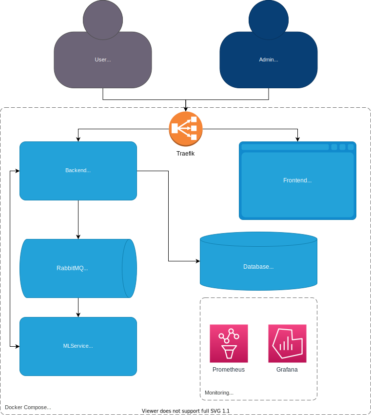

# Backend
---
Back End został stworzony przy użyciu frameworka [FastAPI.](https://fastapi.tiangolo.com/)

Autoryzacja i uwierzytelnianie użytkowników odbywa się przy pomocy schematu OAuth 2.0 z użyciem JWT.
> Dane o sesjach **nie** są przechowywane w bazie danych!

Dokumentacja endpointów jest dostępna pod adresem **/api/v1/docs** po uruchomieniu aplikacji.

Aplikacja posiada jeden endpoint będący WebSocketem, na którym wysyłane są zdarzenia związane z wybranym projektem.

> **/project/{project_id}/ws** - gdzie {project_id} to ID projektu, o którym informacje mają być wysłane.
> Dane są wysyłane w formacie:
> 
> { 
> "event":"EventAction",
>  "projectId":"{projectId}"
>  }
> 
> Możliwe typy *EventAction* to:
> * FileAdded
> * FileDeleted
> * ModelTraining
> * ProjectDeleted

## Architektura aplikacji

## Schemat bazy danych
Baza danych użyta w projekcie to [MongoDB](https://www.mongodb.com/)

---

Diagrams created with [DrawIO](https://www.diagrams.net/)